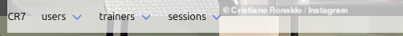
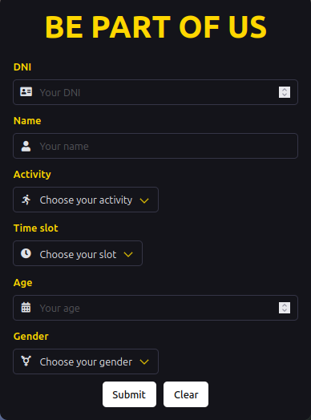
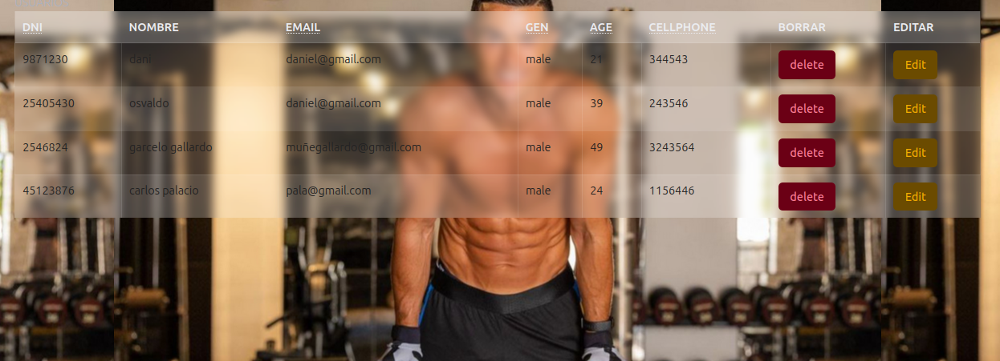
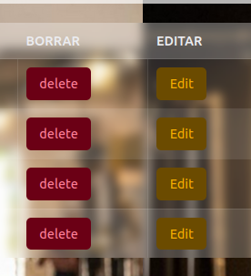

# jvgg
desarrollo de nuestra api

el  objetivo de esta api es mejorar la organizacion de los propietarios de gimnacios logrando mejorar el seguimiento de sus entrendores, atletas y clases que se lleven a cabo.

### Requirements:
    docker
    node
    prisma
    Cors
    express

### set up:
    npx prisma migrate dev
    npm install --save-dev nodemon
    docker compose -d

### start 
    npm run dev
    docker compose -d
    npm run star

*Con nuestro menú podrás desplazarte mediante toda la página*

podras ingresar informacion mediante formularios*

donde se guardaran en forma de tabla

teniendo la posibilidad de eliminar y actualizar informacion
    

